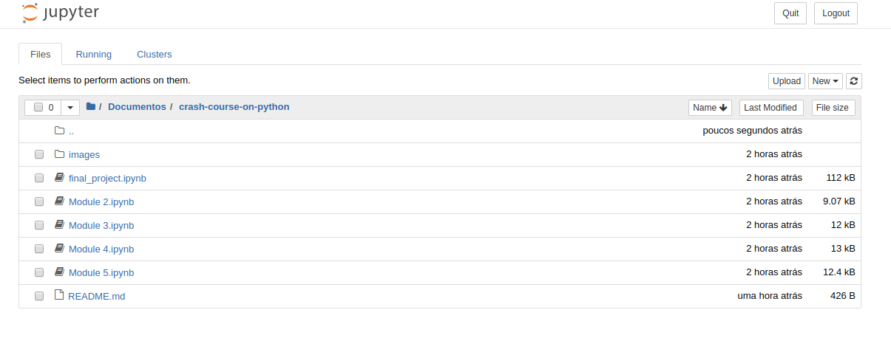
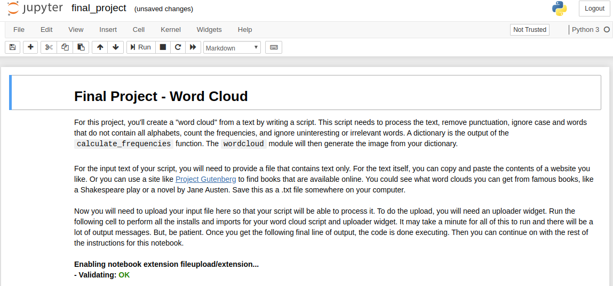

<h1 align="center">
     Python Crash Course
</h1>

    This repository references the evaluations of the <a href="https://www.coursera.org/learn/python-crash-course/">python coursera course</a>

## Usage:

To execute or modify this material it is necessary to use the <a href="https://jupyter.org/">jupyter notebook</a>

## License:

[MIT](https://choosealicense.com/licenses/mit/)